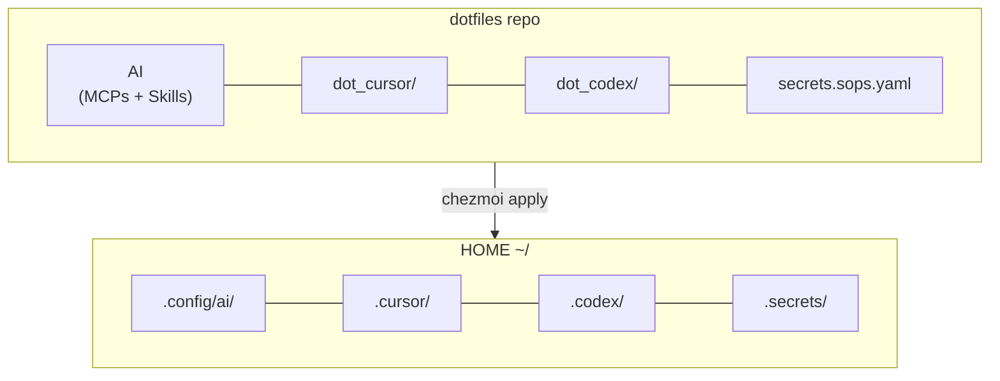

# Dotfiles


> **Aviso:** Este es un proyecto personal. No experimentes con estos dotfiles si no tienes un mínimo de experiencia con Linux y la terminal: podrías sobrescribir o romper configuraciones en tu sistema.

## Qué es este repositorio

`dotfiles` es una **capa de configuración de usuario para Linux y WSL2 Ubuntu**. Prepara el entorno personal de desarrollo y operación instalando herramientas a nivel de usuario, configurando shell/CLI/dotfiles y exponiendo skills y comandos útiles para agentes IA.

Actúa como:

- **Bootstrap** de máquina nueva (`make install*`).
- **Configuración de usuario** Linux/WSL (zsh, Oh My Zsh, Powerlevel10k, tmux, Neovim, aliases).
- **Capa CLI de mantenimiento** (`ups`, `deps-*`).
- **Base de skills y comandos** para agentes IA (Cursor, Codex, OpenCode) gestionada con Chezmoi + SOPS + Age.
- **Puente transversal** para trabajar en proyectos que viven **fuera** del repo, por ejemplo:
  - `~/proyectos/`
  - `~/store-etl/`
  - `/mnt/c/Users/<user>/Documents/vault_trabajo/` (MCP Obsidian/Filesystem: dato Chezmoi `ai.obsidian_vault_path`; ver [docs/CHEZMOI.md](docs/CHEZMOI.md))

Esos proyectos **no viven dentro** de `dotfiles`; este repo solo prepara el entorno para que trabajar con ellos sea más rápido, más seguro y reproducible.

### Idempotencia

Todos los flujos (`make install*`, `ups`, `make deps-*`) están diseñados para **ejecutarse más de una vez** sin romper el entorno ni duplicar instalaciones innecesarias. `DRY_RUN=1` permite previsualizar cualquier paso de bootstrap antes de aplicarlo.

## Arquitectura



| Sistema | Gestiona | Doc |
|---------|----------|-----|
| **`make install*`** | Bootstrap inicial: APT, externos, chezmoi, verificación | [docs/ops/dotfiles-install.md](docs/ops/dotfiles-install.md) |
| **Chezmoi + SOPS + Age** | MCPs, secretos, AI Workstation y zsh stack RC files (`.zshrc`, `.p10k.zsh`, `.aliases`) | [docs/CHEZMOI.md](docs/CHEZMOI.md) |
| **`ups`** | Mantenimiento periódico (APT + npm + MCP + OMZ) | [docs/UPS.md](docs/UPS.md) |
| **`make deps-*`** | Inventario declarativo de dependencias | [docs/SYSTEM_DEPENDENCIES.md](docs/SYSTEM_DEPENDENCIES.md) |

> Legacy: RCM (`rcup`) gestionaba históricamente `~/.zshrc`/`~/.aliases`/`~/.p10k.zsh`. Se ha retirado del flujo activo. Hoy esos symlinks los crea Chezmoi en `make install-dotfiles DOTFILES_APPLY=1`.

## Instalación / Bootstrap

> Bootstrap inicial idempotente para Ubuntu nativo o **WSL2 Ubuntu** (PC corporativo Windows 11 Pro). La lógica vive en `scripts/install-*.sh`; el Makefile sólo orquesta.

### Comandos recomendados

```bash
make install-check              # diagnóstico (no muta)
make ai-mcp-validate            # valida el manifiesto canónico MCP (PyYAML; no muta)
make ai-mcp-render              # render dry-run MCP a build/mcps/ (no toca plantillas Chezmoi)
make ai-mcp-drift               # informe de drift manifiesto+recetas vs plantillas (exit 1 si hay drift inesperado)
make ai-mcp-governance          # valida+render+drift en un paso (no muta; mismo contrato que los tres anteriores)
make ai-mcp-generate            # plan: no escribe; con APPLY=1 valida+render+drift y actualiza plantillas MCP Chezmoi
make ai-cursor-check            # readiness Cursor/MCP/skills (no muta; ver docs/MCP_QUICKREF.md)
make install DRY_RUN=1          # plan completo sin tocar el sistema
make install                    # bootstrap real (no aplica chezmoi por defecto)
make install-zsh-stack          # Oh My Zsh + Powerlevel10k + plugins (idempotente)
make install-uv                 # uv (preferido para Python) — opt-in, fuera de make install
make install-dotfiles DOTFILES_APPLY=1   # activación explícita de chezmoi apply
```

Variante prudente para entornos corporativos:

```bash
make install SKIP_EXTERNAL=1
```

### Targets disponibles

| Target | Rol |
|--------|-----|
| `make install-check` | Preflight de bootstrap. Modo normal: `MISSING/WARN` no bloquean. `STRICT=1`: requeridos declarativos = `FAIL`. |
| `make install-apt` | Instala paquetes APT desde [`system/packages/*.yaml`](system/packages/) (mismo backend que `make deps-install`). |
| `make install-external` | Solo recomendaciones (`make deps-actions`); detecta Docker, `wt.exe`, `winget.exe`, zsh stack — **nunca** instala host-side ni Docker Desktop. |
| `make install-zsh-stack` | Clona Oh My Zsh, Powerlevel10k y plugins custom solo si faltan. **No** edita `~/.zshrc`: ese symlink lo crea Chezmoi en `make install-dotfiles DOTFILES_APPLY=1`. |
| `make install-uv` | Instala **uv** (herramienta Python preferida) con el instalador oficial de Astral. Idempotente, opt-in, **fuera** de `make install`. No edita `~/.zshrc` ni `~/.bashrc`. |
| `make install-dotfiles` | Plan chezmoi. **No ejecuta `apply`** salvo `DOTFILES_APPLY=1`. |
| `make install-verify` | Versiones de zsh/git/chezmoi/sops/age/rg/docker. `STRICT=1` hace fallar si hay `FAIL` real. |
| `make ai-mcp-validate` | Valida [ai/assets/mcps/MANIFEST.yaml](ai/assets/mcps/MANIFEST.yaml): intención canónica de MCPs por agente (Cursor/Codex/OpenCode). Requiere PyYAML. No muta; no sustituye aún a las plantillas Chezmoi. |
| `make ai-mcp-render` | Genera evidencia bajo `build/mcps/` (JSON Cursor, fragmento TOML `mcp_servers`, JSON OpenCode) desde el manifiesto + recetas Python. No muta `dot_cursor/`, `dot_codex/`, `dot_config/`. |
| `make ai-mcp-drift` | Compara ese render con las plantillas actuales; `exit 0` si solo hay `INTENTIONAL_PENDING_PARITY`, `exit 1` si hay `UNEXPECTED_DRIFT`. Escribe `build/mcps/drift-report.json`. |
| `make ai-mcp-governance` | Encadena **`ai-mcp-validate`**, **`ai-mcp-render`** y **`ai-mcp-drift`** vía [`bin/validate-mcp-governance`](bin/validate-mcp-governance). No muta. Propaga códigos de salida (p. ej. `2` si falta PyYAML). No sustituye a **`make ai-cursor-check`** (readiness en HOME). |
| `make ai-mcp-generate` | Sin `APPLY=1`: solo plan (no muta). Con **`APPLY=1`**: ejecuta validación + render + drift; si hay `UNEXPECTED_DRIFT` no escribe; si no, actualiza `dot_cursor/mcp.json.tmpl`, `dot_codex/config.toml.tmpl` (solo bloque `mcp_servers`, conserva preámbulo y `[plugins.*]`), `dot_config/opencode/opencode.json.tmpl`. Copias de respaldo bajo `build/mcps/backups/`. Luego hace falta **chezmoi apply** para HOME. |
| `make ai-cursor-check` | Comprueba sin mutar si `~/.cursor/mcp.json`, skills enlazados y comandos AI están alineados con los templates del repo. No instala ni ejecuta Cursor ni MCPs. `STRICT=1` endurece (p. ej. falta `~/.cursor/mcp.json`). |
| `make install` | Encadena: check → apt → external → dotfiles → verify. |

Variables soportadas: `DRY_RUN=1`, `STRICT=1`, `SKIP_EXTERNAL=1`, `SKIP_DOCKER=1`, `DOTFILES_APPLY=1`.

**Skill para agentes:** [`Dotfiles bootstrap install`](ai/assets/skills/ops/dotfiles-install/SKILL.md).

## Cuándo usar qué: source y chezmoi

| Acción | Cuándo usarla |
|--------|----------------|
| **`chezmoi --source=$HOME/dotfiles apply`** (o `make install-dotfiles DOTFILES_APPLY=1`) | Cambias en el repo cualquier fichero gestionado por Chezmoi (MCPs, plantillas en `dot_cursor/`, `dot_codex/`, secretos, runtime AI, `~/.zshrc`, `~/.p10k.zsh`, `~/.aliases`). |
| **`source ~/.zshrc`** | Después de `chezmoi apply` o de `ups`: recarga aliases/funciones/PATH en la sesión actual. |

**Detalle:** [docs/CHEZMOI.md](docs/CHEZMOI.md).

## Update / Mantenimiento periódico

```bash
cd ~/dotfiles
git pull
chezmoi --source=$HOME/dotfiles apply
source ~/.zshrc
```

Actualización integral del sistema: `ups` (APT, npm, Oh My Zsh, MCPs). Ver [docs/UPS.md](docs/UPS.md).

## Guías rápidas

| Tarea | Doc |
|-------|-----|
| Bootstrap inicial detallado | [docs/INSTALL.md](docs/INSTALL.md) |
| Inventario declarativo de dependencias | [docs/SYSTEM_DEPENDENCIES.md](docs/SYSTEM_DEPENDENCIES.md) |
| CLI `make install*` | [docs/ops/dotfiles-install.md](docs/ops/dotfiles-install.md) |
| Mantenimiento periódico | [docs/UPS.md](docs/UPS.md) |
| Chezmoi + SOPS + Age | [docs/CHEZMOI.md](docs/CHEZMOI.md) |
| MCPs, skills, comandos AI | [docs/GUIA_MCP_AI.md](docs/GUIA_MCP_AI.md) |
| Añadir un secreto | [docs/SECRETS_EXAMPLES.md](docs/SECRETS_EXAMPLES.md) |
| Cambiar token GitHub | [docs/CAMBIAR_TOKEN_GITHUB.md](docs/CAMBIAR_TOKEN_GITHUB.md) |
| Git workflow (feat, rel, changelog) | [docs/GIT_WORKFLOW.md](docs/GIT_WORKFLOW.md) |
| AI Workstation Framework | [ai/README.md](ai/README.md) |
| Índice general | [docs/README.md](docs/README.md) |

## Estructura del repo

```
dotfiles/
├── ai/                 # AI Workstation (MCPs, skills, prompts, runtime)
├── dot_cursor/         # Templates MCP Cursor
├── dot_codex/          # Templates Codex
├── docs/               # Documentación
├── install.mk          # Targets make install*
├── scripts/            # Scripts versionados (install-*, deps-*, git-*, ...)
├── system/packages/    # Inventario YAML declarativo (APT/external/env)
├── zsh, tmux, vim/     # Shell, terminal, editor
└── secrets.sops.yaml   # Secretos cifrados
```

## Customizations

Override por host opcional en `~/.zshrc.local` (cargado por `zsh/90-local.zsh`) y, para Chezmoi, en `~/.config/chezmoi/chezmoi.toml` (fusionado con `.chezmoi.toml` del repo).

## Testing

```bash
make test           # All tests
make test-fast      # Lint + bats (más rápido)
make bats-system    # Solo tests del área install / deps
make test-install   # Instala dependencias de test (shellcheck, shfmt, bats)
```

Ver [docs/TESTING.md](docs/TESTING.md) para más detalle.

## Resources

| Recurso | Enlace |
|---------|--------|
| Chezmoi | [chezmoi.io](https://www.chezmoi.io/) |
| SOPS | [github.com/getsops/sops](https://github.com/getsops/sops) |
| Age | [github.com/FiloSottile/age](https://github.com/FiloSottile/age) |
| Oh My Zsh | [ohmyz.sh](https://ohmyz.sh/) |
| Powerlevel10k | [github.com/romkatv/powerlevel10k](https://github.com/romkatv/powerlevel10k) |

## License

MIT
