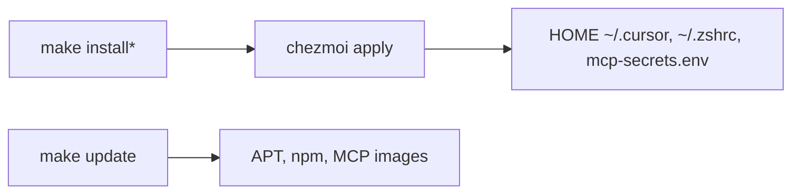

# Dotfiles


> **Aviso:** Proyecto personal. Requiere experiencia con Linux/WSL: `chezmoi apply` puede sobrescribir configuración en HOME.

Capa de configuración de usuario para **Ubuntu LTS / WSL2** (Windows 11 Pro): shell, MCPs para agentes IA, secretos cifrados y mantenimiento del sistema.

> **Legacy:** RCM (`rcup`, `.rcrc`) fue el gestor histórico de symlinks. **No es operativo.** El flujo canónico es **Chezmoi** + **SOPS/age**.

---

## Arquitectura en tres capas

| Capa | Herramientas | Rol |
|------|--------------|-----|
| **Bootstrap** | `make install*`, `make deps-*` | APT, diagnóstico, opt-in (`install-chezmoi`, `install-sops`, `install-zsh-stack`) |
| **Materialización** | `chezmoi status` / `diff` / `apply` | Symlinks RC, MCPs, `~/.config/mcp-secrets.env` generado, runtime AI |
| **Mantenimiento** | `make update`, `make ai-cursor-check`, `make ai-mcp-governance` | Sistema y herramientas — **no** sustituye `chezmoi apply` |



---

## Qué comando usar cuándo

| Situación | Comando |
|-----------|---------|
| Máquina nueva, instalar paquetes base | `make install-check` → `make install` (ver [INSTALL.md](docs/INSTALL.md)) |
| Publicar plantillas y secretos a HOME | `chezmoi --source=$HOME/dotfiles apply` o `make install-dotfiles DOTFILES_APPLY=1` |
| Solo recargar aliases/PATH en la sesión | `source ~/.zshrc` |
| Editar token GitHub, DSN Postgres, MinIO | `sops secrets.sops.yaml` → `chezmoi apply -i scripts` |
| Actualizar Windows/WSL, APT, npm, OMZ, MCPs | `make update` |
| Diagnosticar readiness para agentes IA | `make ai-doctor` |
| Validar Cursor/MCP/skills en HOME | `make ai-cursor-check` |
| Validar MANIFEST ↔ plantillas en repo | `make ai-mcp-governance` |
| Regenerar plantillas MCP desde MANIFEST | `make ai-mcp-generate APPLY=1` → `chezmoi apply` |

`make install` **no** ejecuta `chezmoi apply` por defecto. Son pasos distintos.
`make ai-doctor` es read-only: agrega checks existentes y escanea secretos del repo con `gitleaks`.

---

## Máquina nueva (resumen)

```bash
git clone https://github.com/jesuserro/dotfiles.git ~/dotfiles && cd ~/dotfiles
make install-check && make install SKIP_EXTERNAL=1
make install-chezmoi && make install-sops && make install-zsh-stack
# Restaurar ~/.config/sops/age/keys.txt (manual)
sops secrets.sops.yaml
make install-dotfiles DOTFILES_APPLY=1
source ~/.zshrc
```

Detalle: [docs/INSTALL.md](docs/INSTALL.md) · operación diaria: [docs/OPERATIONS.md](docs/OPERATIONS.md).

---

## Máquina existente (resumen)

```bash
cd ~/dotfiles && git pull
chezmoi --source="$HOME/dotfiles" status
chezmoi --source="$HOME/dotfiles" apply
source ~/.zshrc
# opcional: make update
```

---

## Documentación

| Doc | Contenido |
|-----|-----------|
| **[docs/OPERATIONS.md](docs/OPERATIONS.md)** | Guía operativa principal (flujos, secretos, MCPs, riesgos, chuleta) |
| [docs/INSTALL.md](docs/INSTALL.md) | Bootstrap e instalación inicial |
| [docs/CHEZMOI.md](docs/CHEZMOI.md) | Chezmoi, SOPS, symlinks RC, scripts, `ZSH_RC_APPLY` |
| [docs/SECRETS_EXAMPLES.md](docs/SECRETS_EXAMPLES.md) | Ejemplos de secretos (GitHub, Postgres, MinIO) |
| [docs/UPDATE.md](docs/UPDATE.md) | `make update` (mantenimiento; no aplica Chezmoi) |
| [docs/GUIA_MCP_AI.md](docs/GUIA_MCP_AI.md) | MCPs, skills, comandos AI |
| [docs/MCP_QUICKREF.md](docs/MCP_QUICKREF.md) | Referencia rápida para agentes |
| [docs/README.md](docs/README.md) | Índice completo |

## Estructura y testing

```
dotfiles/
├── ai/                 # MCPs, skills, MANIFEST
├── dot_cursor/         # Plantillas MCP Cursor
├── docs/               # Documentación humana
├── secrets.sops.yaml   # Secretos cifrados (SOPS)
└── zshrc, aliases/     # RC gestionados por symlinks Chezmoi
```

```bash
make test-fast
make ai-doctor
```

Ver [docs/TESTING.md](docs/TESTING.md) · árbol: [STRUCTURE.md](STRUCTURE.md).

## License

MIT
