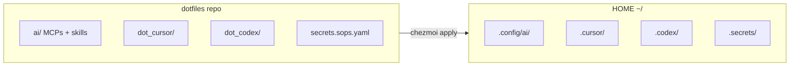

# Dotfiles


Personal dotfiles para Ubuntu 20.04+, Zsh, Oh My Zsh, TMUX y Neovim. Incluye **AI Workstation** (MCPs, skills, secretos) gestionado con Chezmoi.

---

## Arquitectura



| Sistema | Gestiona | Doc |
|---------|----------|-----|
| **Chezmoi + SOPS + Age** | MCPs, secretos, AI Workstation | [CHEZMOI.md](docs/CHEZMOI.md) |
| **RCM (rcup)** | zsh, tmux, vim, aliases | [RCM](http://thoughtbot.github.io/rcm/) |

---

## Install

```bash
git clone https://github.com/jesuserro/dotfiles.git ~/dotfiles
cd ~/dotfiles
chezmoi --source=$HOME/dotfiles apply
rcup -v && source ~/.zshrc
```

**Guía completa:** [docs/INSTALL.md](docs/INSTALL.md) — requisitos, Age, SOPS, secretos.

---

## Guías rápidas

| Tarea | Doc |
|-------|-----|
| Añadir un **MCP** servidor | [GUIA_MCP_AI.md](docs/GUIA_MCP_AI.md#3-añadir-un-nuevo-mcp-servidor-python) |
| Añadir un **skill** | [GUIA_MCP_AI.md](docs/GUIA_MCP_AI.md#4-añadir-un-skill) |
| Añadir un **secreto** (Postgres, MinIO) | [SECRETS_EXAMPLES.md](docs/SECRETS_EXAMPLES.md) |
| Cambiar **token GitHub** | [CAMBIAR_TOKEN_GITHUB.md](docs/CAMBIAR_TOKEN_GITHUB.md) |
| Aplicar cambios | `chezmoi --source=$HOME/dotfiles apply` |

---

## Update

```bash
cd ~/dotfiles
git pull
chezmoi --source=$HOME/dotfiles apply
rcup -v
source ~/.zshrc
```

---

## Documentación

| Doc | Contenido |
|-----|-----------|
| [docs/README.md](docs/README.md) | Índice completo |
| [docs/INSTALL.md](docs/INSTALL.md) | Instalación paso a paso |
| [docs/GUIA_MCP_AI.md](docs/GUIA_MCP_AI.md) | MCPs, skills, comandos |
| [docs/CHEZMOI.md](docs/CHEZMOI.md) | Chezmoi + SOPS + Age |
| [docs/GIT_WORKFLOW.md](docs/GIT_WORKFLOW.md) | Git (feat, rel, changelog) |
| [ai/README.md](ai/README.md) | AI Workstation Framework |

---

## Estructura del repo

```
dotfiles/
├── ai/                 # AI Workstation (MCPs, skills)
├── dot_cursor/         # Templates MCP Cursor
├── dot_codex/          # Templates Codex
├── docs/               # Documentación
├── zsh, tmux, vim/     # Shell, terminal, editor
└── secrets.sops.yaml   # Secretos cifrados
```

---

## Customizations

`~/dotfiles-local/*.local` — aliases, gitconfig, tmux, vimrc, zshrc. Ver [RCM](http://thoughtbot.github.io/rcm/).

---

## Resources

| Recurso | Enlace |
|---------|--------|
| Chezmoi | [chezmoi.io](https://www.chezmoi.io/) |
| SOPS | [github.com/getsops/sops](https://github.com/getsops/sops) |
| Age | [github.com/FiloSottile/age](https://github.com/FiloSottile/age) |
| RCM | [thoughtbot.github.io/rcm](http://thoughtbot.github.io/rcm/) |

---

## License

MIT
