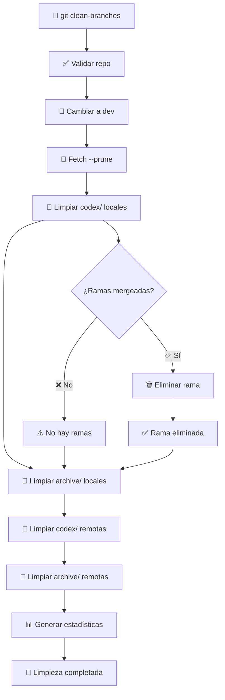

# 🧹 Git Clean Branches Script (`git_clean_branches.sh`)

> **Script automatizado para limpiar ramas `codex/` y `archive/` mergeadas en `dev`, manteniendo el repositorio organizado.**

## 📋 Tabla de Contenidos

- [🎯 Descripción](#-descripción)
- [✨ Características](#-características)
- [🔧 Instalación](#-instalación)
- [📖 Uso Básico](#-uso-básico)
- [🎛️ Opciones](#️-opciones)
- [🔄 Flujo de Trabajo](#-flujo-de-trabajo)
- [📊 Estadísticas](#-estadísticas)
- [🛡️ Ramas Protegidas](#-ramas-protegidas)
- [⚡ Casos de Uso](#-casos-de-uso)
- [🔧 Configuración](#-configuración)
- [❓ FAQ](#-faq)

## 🎯 Descripción

El script `git_clean_branches.sh` automatiza la limpieza de ramas que ya han sido integradas en `dev`. Se enfoca en ramas `codex/` (generadas por IA) y `archive/` (features integradas), eliminando tanto versiones locales como remotas para mantener el repositorio limpio y organizado.

## ✨ Características

- 🧹 **Limpieza automática**: Elimina ramas mergeadas en `dev`
- 📦 **Doble limpieza**: Local y remota en una sola ejecución
- 🛡️ **Ramas protegidas**: Preserva `main`, `master`, `dev`
- 📊 **Estadísticas detalladas**: Muestra resumen de limpieza
- 🔄 **Fetch automático**: Ejecuta `git fetch --prune` antes de limpiar
- 🎨 **Output colorido**: Interfaz visual con colores y emojis
- 🔒 **Seguridad**: Solo elimina ramas mergeadas en `dev`

## 🔧 Instalación

El script ya está configurado en tu `~/.gitconfig` con el alias:

```bash
clean-branches = "!f() { if [ -x ~/dotfiles/scripts/git_clean_branches.sh ]; then bash ~/dotfiles/scripts/git_clean_branches.sh \"$@\"; else echo '⚠️  Advertencia: El script git_clean_branches.sh no tiene permisos de ejecución. Ejecuta: chmod +x ~/dotfiles/scripts/git_clean_branches.sh'; fi; }; f"
```

## 📖 Uso Básico

### 🎯 Comando Principal

```bash
git clean-branches
```

### 📊 Ejemplo de Salida

```
🧹 Iniciando limpieza de ramas codex/ y archive/...

🔄 Cambiando a la rama 'dev'...
✅ Cambiado a 'dev'

🔄 Ejecutando git fetch --prune...
✅ Fetch --prune completado

🧹 Limpiando ramas locales 'codex/*' mergeadas en dev...
🗑️  Borrando rama local: codex/feature-1
✅ Rama local 'codex/feature-1' borrada
🗑️  Borrando rama local: codex/bugfix-123
✅ Rama local 'codex/bugfix-123' borrada
📊 Ramas locales 'codex/*' borradas: 2

🧹 Limpiando ramas locales 'archive/*' mergeadas en dev...
🗑️  Borrando rama local: archive/feature/login-system
✅ Rama local 'archive/feature/login-system' borrada
📊 Ramas locales 'archive/*' borradas: 1

🧹 Limpiando ramas remotas 'codex/*' mergeadas en dev...
🗑️  Borrando rama remota: codex/feature-1
✅ Rama remota 'codex/feature-1' borrada
📊 Ramas remotas 'codex/*' borradas: 1

🧹 Limpiando ramas remotas 'archive/*' mergeadas en dev...
📊 Ramas remotas 'archive/*' borradas: 0

📋 Resumen de limpieza:
┌─────────────────────────────────────────────────────────────┐
│ Tipo de Rama    │ Locales │ Remotas │ Total │
├─────────────────┼─────────┼─────────┼───────┤
│ codex/          │       2 │       1 │     3 │
│ archive/        │       1 │       0 │     1 │
├─────────────────┼─────────┼─────────┼───────┤
│ TOTAL           │       3 │       1 │     4 │
└─────────────────┴─────────┴─────────┴───────┘

🎉 ¡Limpieza de ramas completada exitosamente!
💡 Rama actual: dev
```

## 🎛️ Opciones

### 🆘 Ayuda

```bash
git clean-branches --help
# o
git clean-branches -h
```

## 🔄 Flujo de Trabajo



## 📊 Estadísticas

### 📋 Tabla de Resumen

El script genera una tabla detallada con estadísticas:

| Tipo de Rama | Locales | Remotas | Total |
|--------------|---------|---------|-------|
| `codex/`     | 2       | 1       | 3     |
| `archive/`   | 1       | 0       | 1     |
| **TOTAL**    | **3**   | **1**   | **4** |

### 📈 Métricas

- **Ramas locales**: Eliminadas del repositorio local
- **Ramas remotas**: Eliminadas del repositorio remoto
- **Total**: Suma de todas las ramas eliminadas

## 🛡️ Ramas Protegidas

### 🔒 Ramas que NO se eliminan

El script protege automáticamente estas ramas:

```bash
BRANCHES_TO_KEEP=("main" "master" "dev")
```

### 🛡️ Criterios de Protección

- **Ramas principales**: `main`, `master`, `dev`
- **Ramas no mergeadas**: Solo elimina ramas mergeadas en `dev`
- **Ramas con cambios**: No elimina ramas con commits no integrados

## ⚡ Casos de Uso

### 🧹 Limpieza Regular

```bash
# Limpieza después de integrar features
git feat feature-1
git feat feature-2
git clean-branches  # Limpia las ramas archivadas
```

### 🔄 Limpieza Periódica

```bash
# Limpieza semanal de ramas codex/
git clean-branches

# Resultado: Elimina ramas codex/ y archive/ mergeadas
```

### 📦 Limpieza Después de Release

```bash
# Después de hacer release
git rel
git clean-branches  # Limpia ramas archivadas del release
```

### 🧪 Limpieza de Desarrollo

```bash
# Limpiar ramas de experimentación
git clean-branches

# Mantiene solo ramas activas y principales
```

## 🔧 Configuración

### 📁 Variables del Script

```bash
# En scripts/git_clean_branches.sh
DEV_BRANCH="dev"                    # Rama de desarrollo
CODEX_PREFIX="codex/"               # Prefijo para ramas de IA
ARCHIVE_PREFIX="archive/"           # Prefijo para ramas archivadas
BRANCHES_TO_KEEP=("main" "master" "dev")  # Ramas protegidas
```

### 🎨 Personalización

```bash
# Cambiar prefijos
CODEX_PREFIX="ai/"
ARCHIVE_PREFIX="archived/"

# Añadir más ramas protegidas
BRANCHES_TO_KEEP=("main" "master" "dev" "staging" "production")

# Cambiar rama de desarrollo
DEV_BRANCH="develop"
```

### 🔧 Permisos de Ejecución

Si el script no tiene permisos de ejecución:

```bash
chmod +x ~/dotfiles/scripts/git_clean_branches.sh
```

## ❓ FAQ

### 🤔 ¿Qué ramas elimina el script?

Solo elimina ramas que:
- Empiecen con `codex/` o `archive/`
- Estén mergeadas en `dev`
- No sean `main`, `master` o `dev`

### 🛡️ ¿Es seguro ejecutar el script?

Sí, es muy seguro porque:
- Solo elimina ramas mergeadas en `dev`
- Protege ramas principales
- No elimina ramas con cambios no integrados

### 🔄 ¿Qué pasa si una rama no se puede eliminar?

El script muestra un mensaje de error pero continúa con las demás ramas:

```
❌ No se pudo borrar la rama local 'codex/feature-1' (puede tener cambios no mergeados)
```

### 📊 ¿Cómo interpretar las estadísticas?

- **Locales**: Ramas eliminadas de tu repositorio local
- **Remotas**: Ramas eliminadas del repositorio remoto
- **Total**: Suma de todas las ramas eliminadas

### 🧹 ¿Con qué frecuencia debo ejecutar el script?

**Recomendado:**
- Después de cada `git feat` (limpieza de archive/)
- Semanalmente para limpiar ramas codex/
- Antes de releases importantes

### 🔍 ¿Cómo ver qué ramas se van a eliminar?

```bash
# Ver ramas codex/ mergeadas en dev
git branch --merged dev | grep "^codex/"

# Ver ramas archive/ mergeadas en dev
git branch --merged dev | grep "^archive/"
```

### 🛠️ ¿Qué hacer si elimino una rama por error?

```bash
# Recuperar rama local (si existe en remoto)
git checkout -b feature/recuperada origin/feature/recuperada

# Recuperar rama remota (si tienes backup)
git push origin feature/recuperada
```

### 🔄 ¿El script afecta a otras ramas?

No, el script solo afecta a:
- Ramas que empiecen con `codex/` o `archive/`
- Ramas mergeadas en `dev`
- No toca ramas activas ni principales

---

## 🎉 ¡Listo para usar!

El script `git_clean_branches.sh` mantiene tu repositorio limpio y organizado automáticamente. ¡Disfruta de un repositorio más ordenado! 🧹 