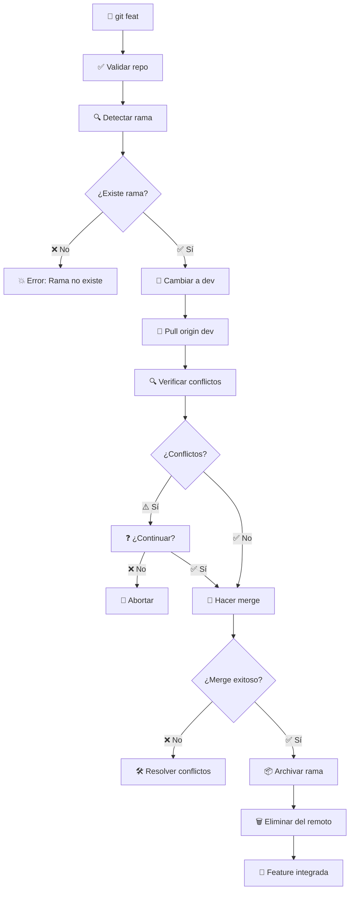

# 🌟 Git Feature Integration Script (`git_feat.sh`)

> **Script automatizado para integrar ramas de features en `dev` y archivarlas automáticamente.**

## 📋 Tabla de Contenidos

- [🎯 Descripción](#-descripción)
- [✨ Características](#-características)
- [🔧 Instalación](#-instalación)
- [📖 Uso Básico](#-uso-básico)
- [🎛️ Opciones](#️-opciones)
- [🔄 Flujo de Trabajo](#-flujo-de-trabajo)
- [📦 Sistema de Archivo](#-sistema-de-archivo)
- [⚡ Casos de Uso](#-casos-de-uso)
- [🛠️ Resolución de Conflictos](#️-resolución-de-conflictos)
- [🔧 Configuración](#-configuración)
- [❓ FAQ](#-faq)

## 🎯 Descripción

El script `git_feat.sh` automatiza el proceso de integración de ramas de features en la rama de desarrollo (`dev`). Incluye detección automática de prefijos, gestión de conflictos y archivo automático de ramas integradas.

## ✨ Características

- 🔍 **Detección automática**: Resuelve automáticamente si la rama tiene prefijo `feature/` o no
- 🔄 **Merge inteligente**: Maneja conflictos potenciales antes del merge
- 📦 **Archivo automático**: Mueve ramas integradas a `archive/` y las elimina del remoto
- 🛡️ **Validaciones**: Verifica estado del repositorio y existencia de ramas
- 🎨 **Output colorido**: Interfaz visual con colores y emojis
- 🔒 **Seguridad**: Confirma antes de continuar con conflictos detectados

## 🔧 Instalación

El script ya está configurado en tu `~/.gitconfig` con el alias:

```bash
feat = "!bash ~/dotfiles/scripts/git_feat.sh"
```

## 📖 Uso Básico

### 🎯 Comando Principal

```bash
git feat <nombre-feature>
```

**Ejemplos:**
```bash
git feat mi-nueva-funcionalidad     # Rama 'feature/mi-nueva-funcionalidad'
git feat feature/login-system       # Rama 'feature/login-system'
git feat login-system               # Rama 'feature/login-system'
```

### 📊 Ejemplo de Salida

```
🚀 Integrando feature 'login-system' en dev...
🔁 Integrando 'feature/login-system' en 'dev'...
🔍 Verificando conflictos potenciales entre 'feature/login-system' y 'dev'...
✅ No se detectaron conflictos potenciales
🔁 Haciendo merge de 'feature/login-system' → 'dev'...
✅ Merge completado: 'feature/login-system' → 'dev'
📦 Archivando rama 'feature/login-system' como 'archive/feature/login-system'...
✅ Rama archivada como 'archive/feature/login-system' y eliminada la original del remoto.
🎉 ¡Feature 'login-system' integrada exitosamente en dev!
💡 Próximo paso: Cuando dev esté listo para producción, ejecuta 'git rel'
```

## 🎛️ Opciones

### 🆘 Ayuda

```bash
git feat --help
# o
git feat -h
```

**Salida:**
```
📖 Uso: git feat <nombre-feature>
📖 Descripción: Integra una rama feature en dev y la archiva
📖 Ejemplos:
  git feat mi-nueva-funcionalidad     # Rama 'feature/mi-nueva-funcionalidad'
  git feat feature/login-system       # Rama 'feature/login-system'
  git feat login-system               # Rama 'feature/login-system'
📖 Opciones:
  --help, -h                          # Mostrar esta ayuda
📖 Flujo:
  1. Se mueve a rama 'dev'
  2. Hace merge de tu feature en dev
  3. Archiva tu rama feature
  4. Termina en rama 'dev'
```

## 🔄 Flujo de Trabajo



## 📦 Sistema de Archivo

### 🏷️ Prefijos Automáticos

El script maneja automáticamente los prefijos:

| 📝 Input | 🔍 Búsqueda | 📦 Rama Final |
|----------|-------------|---------------|
| `login-system` | `feature/login-system` | `archive/feature/login-system` |
| `feature/auth` | `feature/auth` | `archive/feature/auth` |
| `bugfix/123` | `bugfix/123` | `archive/bugfix/123` |

### 📁 Estructura de Archivo

```
Ramas originales:
├── feature/login-system
├── feature/user-profile
└── bugfix/issue-123

Después de git feat:
├── archive/feature/login-system
├── archive/feature/user-profile
└── archive/bugfix/issue-123
```

## ⚡ Casos de Uso

### 🚀 Integración Normal

```bash
# 1. Trabajar en tu feature
git checkout feature/mi-feature
# ... hacer cambios ...
git commit -m "feat: añadir nueva funcionalidad"

# 2. Integrar en dev
git feat mi-feature

# 3. ¡Listo! La feature está en dev y archivada
```

### 🔄 Múltiples Features

```bash
# Integrar varias features secuencialmente
git feat feature-1
git feat feature-2
git feat feature-3

# Todas quedan archivadas y listas para release
```

### 🏷️ Con Diferentes Prefijos

```bash
# Features
git feat login-system
git feat feature/auth

# Bugfixes
git feat bugfix/issue-123

# Hotfixes
git feat hotfix/critical-fix
```

## 🛠️ Resolución de Conflictos

### 🔍 Detección Inteligente

El script detecta conflictos potenciales antes del merge:

```
🔍 Verificando conflictos potenciales entre 'feature/login' y 'dev'...
⚠️  Archivos que podrían causar conflictos:
  • src/auth/login.js
  • tests/auth.test.js
💡 Sugerencia: Considera resolver estos conflictos antes de continuar
⚠️  Se detectaron posibles conflictos. ¿Deseas continuar? (s/N)
```

### ⚠️ Conflictos Reales

Si hay conflictos reales durante el merge:

```
❗ Conflictos detectados entre 'feature/login' y 'dev'
💡 Sugerencia: Resuelve los conflictos y luego ejecuta:
  git add .
  git commit -m "merge: resolve conflicts between feature/login and dev"
```

### 🛠️ Pasos de Resolución

1. **Resolver conflictos manualmente** en los archivos marcados
2. **Añadir cambios**: `git add .`
3. **Completar merge**: `git commit -m "merge: resolve conflicts"`
4. **Continuar**: El script continuará automáticamente

## 🔧 Configuración

### 📁 Variables del Script

```bash
# En scripts/git_feat.sh
DEV_BRANCH="dev"                    # Rama de desarrollo
FEATURE_PREFIX="feature/"           # Prefijo estándar para features
ARCHIVE_PREFIX="archive/"           # Prefijo para archivar ramas
```

### 🎨 Personalización

```bash
# Cambiar prefijos
FEATURE_PREFIX="feat/"
ARCHIVE_PREFIX="archived/"

# Cambiar rama de desarrollo
DEV_BRANCH="develop"
```

## ❓ FAQ

### 🤔 ¿Qué pasa si la rama no existe?

El script busca automáticamente con y sin prefijo `feature/`:

```bash
git feat login-system
# Busca: login-system → feature/login-system
```

### 🔄 ¿Qué pasa si no se puede hacer fast-forward?

El script maneja automáticamente merges no fast-forward y continúa.

### 📦 ¿Dónde van las ramas archivadas?

Las ramas se mueven a `archive/` localmente y se eliminan del remoto para mantener limpio el repositorio.

### 🛠️ ¿Qué hacer si hay conflictos?

1. Resuelve los conflictos manualmente
2. Ejecuta `git add .`
3. Ejecuta `git commit -m "merge: resolve conflicts"`
4. El script continuará automáticamente

### 🔍 ¿Cómo ver ramas archivadas?

```bash
# Ver todas las ramas archivadas
git branch | grep archive/

# Ver ramas archivadas remotas (si existen)
git branch -r | grep archive/
```

### 🗑️ ¿Cómo eliminar ramas archivadas?

```bash
# Eliminar rama archivada local
git branch -D archive/feature/old-feature

# Eliminar rama archivada remota (si existe)
git push origin --delete archive/feature/old-feature
```

### 🔄 ¿Puedo integrar sin archivar?

No, el script siempre archiva las ramas integradas para mantener el repositorio limpio. Si necesitas mantener la rama, haz el merge manualmente.

---

## 🎉 ¡Listo para usar!

El script `git_feat.sh` está diseñado para hacer la integración de features de forma segura y automática. ¡Disfruta de un flujo de trabajo más eficiente! 🌟 