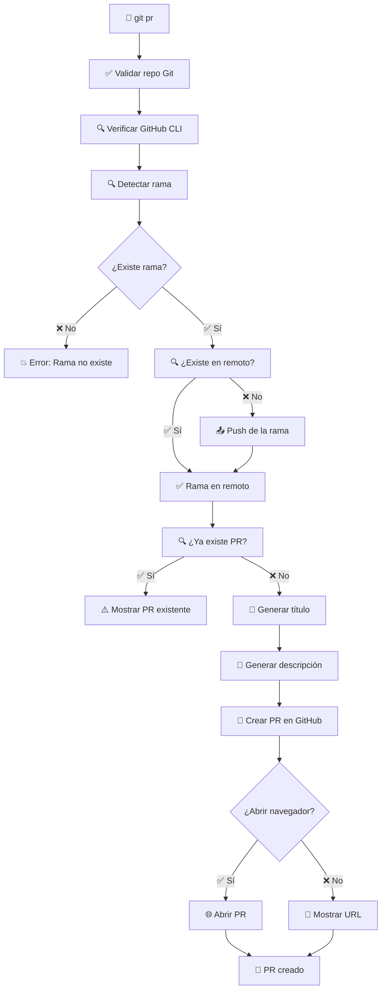

# 🔀 Git Pull Request Script (`git_pr.sh`)

> **Script automatizado para crear Pull Requests de GitHub desde la terminal con título y descripción generados automáticamente.**

## 📋 Tabla de Contenidos

- [🎯 Descripción](#-descripción)
- [✨ Características](#-características)
- [🔧 Instalación](#-instalación)
- [📖 Uso Básico](#-uso-básico)
- [🎛️ Opciones](#️-opciones)
- [🔄 Flujo de Trabajo](#-flujo-de-trabajo)
- [📝 Generación Automática](#-generación-automática)
- [⚡ Casos de Uso](#-casos-de-uso)
- [🔧 Configuración](#-configuración)
- [❓ FAQ](#-faq)

## 🎯 Descripción

El script `git_pr.sh` automatiza la creación de Pull Requests en GitHub desde la terminal. Detecta automáticamente la rama feature, genera título y descripción basados en los commits y cambios, y crea el PR usando GitHub CLI (`gh`).

## ✨ Características

- 🔍 **Detección automática**: Resuelve automáticamente si la rama tiene prefijo `feature/` o no
- 📝 **Título automático**: Extrae el título del primer commit o lo genera desde el nombre de la rama
- 📄 **Descripción automática**: Incluye commits, archivos modificados y estadísticas
- 📤 **Push automático**: Publica la rama en remoto si no existe
- 🔍 **Detección de PRs existentes**: Verifica si ya existe un PR para la rama
- 🎨 **Output colorido**: Interfaz visual con colores y emojis
- 🛡️ **Validaciones**: Verifica GitHub CLI, autenticación y existencia de ramas
- 🌐 **Apertura automática**: Abre el PR en el navegador automáticamente

## 🔧 Instalación

### Requisitos Previos

1. **GitHub CLI (`gh`)**: Debe estar instalado y autenticado
   ```bash
   # Verificar instalación
   gh --version
   
   # Si no está instalado, instálalo desde: https://cli.github.com/
   
   # Autenticarse
   gh auth login
   ```

2. **Script configurado**: El script ya está configurado en tu `~/.gitconfig` con el alias:
   ```bash
   pr = "!bash ~/dotfiles/scripts/git_pr.sh"
   ```

## 📖 Uso Básico

### 🎯 Comando Principal

```bash
git pr <nombre-feature>
```

**Ejemplos:**
```bash
git pr mi-nueva-funcionalidad     # Rama 'feature/mi-nueva-funcionalidad'
git pr feature/login-system       # Rama 'feature/login-system'
git pr login-system               # Rama 'feature/login-system'
```

### 📊 Ejemplo de Salida

```
🚀 Creando Pull Request para feature 'login-system'...
✅ Rama 'feature/login-system' ya existe en remoto
📝 Generando título y descripción del PR...
📋 Título: feat: implementar sistema de login con JWT
🚀 Creando Pull Request 'feature/login-system' → 'dev'...
✅ Pull Request creado exitosamente
🎉 ¡Pull Request creado exitosamente!
```

## 🎛️ Opciones

### 🆘 Ayuda

```bash
git pr --help
# o
git pr -h
```

**Salida:**
```
📖 Uso: git pr <nombre-feature> [opciones]
📖 Descripción: Crea un Pull Request de una rama feature a dev
📖 Ejemplos:
  git pr mi-nueva-funcionalidad     # Rama 'feature/mi-nueva-funcionalidad'
  git pr feature/login-system       # Rama 'feature/login-system'
  git pr login-system               # Rama 'feature/login-system'
📖 Opciones:
  --no-open                         # No abrir el PR en el navegador
  --help, -h                        # Mostrar esta ayuda
📖 Flujo:
  1. Detecta la rama feature
  2. Verifica que existe localmente y en remoto
  3. Genera título y descripción automáticamente
  4. Crea el Pull Request en GitHub
  5. Abre el PR en el navegador (opcional)
```

### 🌐 No Abrir Navegador

Por defecto, el script abre el PR en el navegador. Para evitar esto:

```bash
git pr mi-feature --no-open
```

## 🔄 Flujo de Trabajo



## 📝 Generación Automática

### 🏷️ Título Automático

El script genera el título del PR de dos formas:

1. **Desde el primer commit** (si sigue Conventional Commits):
   - Extrae el mensaje del primer commit
   - Ejemplo: `feat: implementar sistema de login` → Título: `feat: implementar sistema de login`

2. **Desde el nombre de la rama** (fallback):
   - Elimina el prefijo `feature/`
   - Convierte guiones en espacios
   - Capitaliza la primera letra
   - Ejemplo: `feature/login-system` → Título: `Login System`

### 📄 Descripción Automática

La descripción incluye automáticamente:

1. **Estadísticas**:
   - Número de commits
   - Estadísticas de diff (archivos cambiados, líneas añadidas/eliminadas)

2. **Lista de commits**:
   - Todos los commits exclusivos de la feature (comparados con `dev`)
   - Formato: `- <mensaje del commit>`

3. **Archivos modificados**:
   - Lista de archivos con su estado (A=Added, M=Modified, D=Deleted)
   - Limitado a los primeros 20 archivos para mantener la descripción legible

**Ejemplo de descripción generada:**

```markdown
## 📊 Estadísticas

- **Commits:** 5
- **Estadísticas:** 12 files changed, 234 insertions(+), 45 deletions(-)

## 📝 Commits

- feat: añadir autenticación JWT
- feat: implementar middleware de autenticación
- test: añadir tests para login
- docs: actualizar documentación de API
- fix: corregir validación de tokens

## 📁 Archivos Modificados

```
A       src/auth/jwt.js
M       src/middleware/auth.js
A       tests/auth.test.js
M       docs/api.md
D       src/auth/old-auth.js
```
```

## ⚡ Casos de Uso

### 🚀 Crear PR Normal

```bash
# 1. Trabajar en tu feature
git checkout feature/login-system
# ... hacer cambios ...
git commit -m "feat: añadir autenticación JWT"
git push

# 2. Crear Pull Request
git pr login-system

# 3. ¡Listo! El PR está creado y abierto en el navegador
```

### 🔄 Rama No Publicada

Si la rama no está en el remoto, el script la publica automáticamente:

```bash
git pr nueva-feature
# 📤 La rama 'feature/nueva-feature' no existe en el remoto. Haciendo push...
# ✅ Rama 'feature/nueva-feature' publicada en remoto
# 🚀 Creando Pull Request...
```

### 🔍 PR Ya Existente

Si ya existe un PR para la rama, el script lo detecta y muestra el enlace:

```bash
git pr login-system
# ⚠️  Ya existe un Pull Request abierto para 'feature/login-system' → 'dev'
# 🔗 PR existente: https://github.com/usuario/repo/pull/123
# 🌐 Abriendo PR en el navegador...
```

### 🌐 Sin Abrir Navegador

```bash
git pr mi-feature --no-open
# ✅ Pull Request creado exitosamente
# 🔗 PR: https://github.com/usuario/repo/pull/456
```

### 🏷️ Con Diferentes Prefijos

```bash
# Features
git pr login-system
git pr feature/auth

# Bugfixes
git pr bugfix/issue-123

# Hotfixes
git pr hotfix/critical-fix
```

## 🔧 Configuración

### 📁 Variables del Script

```bash
# En scripts/git_pr.sh
DEV_BRANCH="dev"                    # Rama de desarrollo (base del PR)
FEATURE_PREFIX="feature/"           # Prefijo estándar para features
OPEN_BROWSER=true                   # Abrir navegador automáticamente
```

### 🎨 Personalización

```bash
# Cambiar prefijo
FEATURE_PREFIX="feat/"

# Cambiar rama base
DEV_BRANCH="develop"

# Desactivar apertura automática del navegador por defecto
OPEN_BROWSER=false
```

### 🔐 Autenticación de GitHub CLI

Si no estás autenticado con GitHub CLI:

```bash
# Autenticarse
gh auth login

# Verificar estado
gh auth status

# Verificar que puedes crear PRs
gh pr list
```

## ❓ FAQ

### 🤔 ¿Qué pasa si la rama no existe?

El script busca automáticamente con y sin prefijo `feature/`:

```bash
git pr login-system
# Busca: login-system → feature/login-system
```

Si ninguna de las dos existe, muestra un error.

### 📤 ¿Qué pasa si la rama no está en el remoto?

El script detecta automáticamente si la rama no está en el remoto y la publica antes de crear el PR:

```bash
git pr nueva-feature
# 📤 La rama 'feature/nueva-feature' no existe en el remoto. Haciendo push...
```

### 🔍 ¿Qué pasa si ya existe un PR?

El script verifica si ya existe un PR abierto para esa rama. Si existe, muestra el enlace y opcionalmente lo abre en el navegador, sin crear uno nuevo.

### 🚫 ¿Puedo crear un PR sin abrir el navegador?

Sí, usa la opción `--no-open`:

```bash
git pr mi-feature --no-open
```

### 🔐 ¿Qué pasa si GitHub CLI no está instalado?

El script verifica que `gh` esté instalado y autenticado. Si no lo está, muestra un error con instrucciones:

```bash
❌ GitHub CLI (gh) no está instalado.
💡 Instala GitHub CLI: https://cli.github.com/
```

### 📝 ¿Cómo se genera el título del PR?

1. **Primero**: Intenta extraer del primer commit si sigue Conventional Commits
2. **Fallback**: Genera desde el nombre de la rama (sin prefijo, capitalizado)

### 📄 ¿Qué información incluye la descripción?

- Estadísticas: número de commits y diff stats
- Lista completa de commits exclusivos de la feature
- Archivos modificados (primeros 20)

### 🔄 ¿Puedo usar esto con otras ramas base?

Por defecto usa `dev`, pero puedes modificar la variable `DEV_BRANCH` en el script para usar otra rama base.

### 🏷️ ¿Funciona con ramas que no tienen prefijo `feature/`?

Sí, el script detecta automáticamente si la rama tiene o no el prefijo. También funciona con otros prefijos como `bugfix/`, `hotfix/`, etc.

### 🌐 ¿Cómo funciona la apertura del navegador?

El script usa `gh pr create --web` que automáticamente abre el PR en tu navegador predeterminado después de crearlo.

### 🔗 ¿Dónde puedo ver el PR después de crearlo?

El PR se crea en GitHub y puedes:
- Verlo en el navegador (si `OPEN_BROWSER=true`)
- Ver la URL en la salida del script
- Buscarlo en GitHub: `https://github.com/<usuario>/<repo>/pulls`

---

## 🎉 ¡Listo para usar!

El script `git_pr.sh` está diseñado para hacer la creación de Pull Requests de forma rápida y automática, con toda la información necesaria generada automáticamente. ¡Disfruta de un flujo de trabajo más eficiente! 🌟

