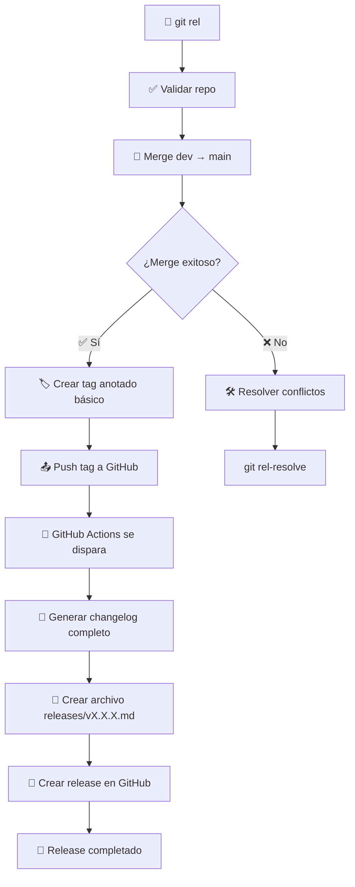

# 🚀 Git Release Script (`git_rel.sh`)

> **Script automatizado para hacer releases de `dev` a `main` con gestión inteligente de conflictos y creación de tags anotados. El changelog y release se generan automáticamente por GitHub Actions cuando se crea el tag.**

## 📋 Tabla de Contenidos

- [🎯 Descripción](#-descripción)
- [✨ Características](#-características)
- [🔧 Instalación](#-instalación)
- [📖 Uso Básico](#-uso-básico)
- [🎛️ Opciones Avanzadas](#️-opciones-avanzadas)
- [🔍 Detección Automática de Tests](#-detección-automática-de-tests)
- [⚡ Casos de Uso](#-casos-de-uso)
- [🛠️ Resolución de Conflictos](#️-resolución-de-conflictos)
- [📊 Flujo de Trabajo](#-flujo-de-trabajo)
- [🔧 Configuración](#-configuración)
- [❓ FAQ](#-faq)

## 🎯 Descripción

El script `git_rel.sh` automatiza el proceso de release de código desde la rama de desarrollo (`dev`) a la rama principal (`main`). Incluye validaciones, gestión inteligente de conflictos y creación de tags anotados. El changelog completo y el release en GitHub se generan automáticamente mediante un workflow de GitHub Actions cuando se crea el tag.

## ✨ Características

- 🔄 **Merge inteligente**: Maneja automáticamente casos de no fast-forward
- 🏷️ **Tags anotados**: Crea tags anotados con formato `vYYYY.MM.DD_HHMM` con mensaje básico
- 🔍 **Detección de conflictos**: Identifica conflictos potenciales antes del merge
- 🎨 **Output colorido**: Interfaz visual con colores y emojis
- 🛡️ **Validaciones**: Verifica estado del repositorio y permisos
- 🤖 **Integración con GitHub Actions**: El changelog y release se generan automáticamente cuando se crea el tag (requiere workflow configurado en el proyecto)

## 🔧 Instalación

El script ya está configurado en tu `~/.gitconfig` con el alias:

```bash
rel = "!bash ~/dotfiles/scripts/git_rel.sh"
```

## 📖 Uso Básico

### 🎯 Comando Principal

```bash
git rel
```

**Ejemplo de salida:**
```
🚀 Iniciando release de dev a main...
🔁 Integrando 'dev' en 'main'...
✅ Merge completado: 'dev' → 'main'
🏷️ Creando tag 'v2025.12.07_1051'...
🏷️ Creando tag anotado 'v2025.12.07_1051' en el commit actual...
📝 Tag se creará en: 7aa62e4 - feat(git_rel): improve tag generation (Jesús Erro)
📤 Subiendo tag a GitHub...
✅ Tag anotado 'v2025.12.07_1051' creado y subido exitosamente a GitHub.
✅ Tag 'v2025.12.07_1051' confirmado en GitHub.
🎉 ¡Release completado exitosamente!
📋 Resumen:
  • dev → main ✅
  • Tag anotado creado: v2025.12.07_1051 ✅
  • Tag en GitHub: https://github.com/user/repo/releases/tag/v2025.12.07_1051
  • Changelog y release: Se generarán automáticamente por GitHub Actions 🔄
```

### 🏷️ Con Versión Específica

```bash
git rel 1.2.3
```

**Resultado:** Crea el tag `v1.2.3`

## 🎛️ Opciones Avanzadas

### 🆘 Ayuda

```bash
git rel --help
# o
git rel -h
```

**Salida:**
```
📖 Uso: git rel [versión]
📖 Ejemplos:
  git rel                    # Release con versión automática
  git rel 1.2.3              # Release con versión específica
📖 Opciones:
  --help, -h                 # Mostrar esta ayuda
```

## 📝 Formato del Tag

El script crea tags anotados con un mensaje básico. El changelog completo se genera automáticamente por GitHub Actions cuando se crea el tag.

**Ejemplo de mensaje del tag:**
```markdown
Release v2025.12.07_1051

**Release Date:** 2025-12-07 10:51

Changelog will be generated automatically by GitHub Actions.
```

> **Nota**: El changelog completo con commits categorizados, archivo `releases/vX.X.X.md` y release en GitHub se generan automáticamente mediante un workflow de GitHub Actions configurado en el proyecto. Ver sección [🤖 Integración con GitHub Actions](#-integración-con-github-actions) para más detalles.

## ⚡ Casos de Uso

### 🚀 Release Normal

```bash
# 1. Asegúrate de estar en dev y tener cambios
git checkout dev
git pull origin dev

# 2. Ejecuta el release
git rel

# 3. ¡Listo! El código está en main con tag
```

### 🔥 Hotfix Urgente

```bash
# Release con versión específica para urgencias
git rel 1.2.4
```

### 🏷️ Release con Versión

```bash
# Release con versión semántica
git rel 2.1.0

# Release con versión personalizada
git rel v2024.01.15-beta
```

## 🛠️ Resolución de Conflictos

### 🔍 Detección Inteligente

El script detecta conflictos potenciales antes del merge:

```
🔍 Verificando conflictos potenciales entre 'dev' y 'main'...
✅ No se detectaron conflictos potenciales
```

### ⚠️ Conflictos Reales

Si hay conflictos reales, el script te guía:

```
❗ Conflictos detectados entre 'dev' y 'main'
💡 Sugerencia: Resuelve los conflictos y luego ejecuta:
  git add .
  git commit -m "merge: resolve conflicts between dev and main"
```

### 🛠️ Script de Resolución

Usa el script auxiliar `git_rel_resolve.sh`:

```bash
# Ver estado del merge
git rel-resolve

# Abortar merge
git rel-resolve --abort

# Continuar después de resolver conflictos
git rel-resolve --continue
```

## 📊 Flujo de Trabajo



### 🤖 Integración con GitHub Actions

El script `git_rel.sh` crea el tag y lo sube a GitHub. Un workflow de GitHub Actions configurado en el proyecto se encarga automáticamente de:

1. **Generar changelog completo**: Calcula commits desde el último tag hasta el actual
2. **Categorizar commits**: Organiza por tipo (feat, fix, docs, etc.) con emojis
3. **Crear archivo de release**: Genera `releases/vX.X.X.md` con el changelog
4. **Crear release en GitHub**: Publica el release con el changelog completo

**Configuración requerida**: Necesitas tener un workflow `.github/workflows/release.yml` en tu proyecto que se dispare cuando se crea un tag `v*`. Ver sección [🔧 Configuración de GitHub Actions](#-configuración-de-github-actions) para más detalles.

## 🔧 Configuración

### 📁 Variables del Script

```bash
# En scripts/git_rel.sh
# NOTA: Esta configuración es estándar para TODOS los proyectos.
# Siempre usamos 'main' como rama principal de producción.
DEV_BRANCH="dev"           # Rama de desarrollo
MAIN_BRANCH="main"         # Rama principal de producción (estándar en todos los proyectos)
TAG_PREFIX="v"             # Prefijo de tags (formato: vYYYY.MM.DD_HHMM)
```

### 🎨 Personalización de Colores

```bash
# Colores disponibles
GREEN='\033[0;32m'         # ✅ Éxito
YELLOW='\033[1;33m'        # ⚠️ Advertencia
RED='\033[0;31m'           # ❌ Error
BLUE='\033[0;34m'          # 💡 Información
NC='\033[0m'               # Reset color
```

### 🤖 Configuración de GitHub Actions

Para que el changelog y release se generen automáticamente, necesitas crear un workflow en tu proyecto:

**Ubicación**: `.github/workflows/release.yml`

**Ejemplo básico**:
```yaml
name: Create Release

on:
  push:
    tags:
      - 'v*'  # Se dispara cuando se crea un tag que empiece con 'v'

jobs:
  create-release:
    runs-on: ubuntu-latest
    permissions:
      contents: write  # Necesario para crear releases
    
    steps:
      - name: Checkout code
        uses: actions/checkout@v4
        with:
          fetch-depth: 0  # Necesario para obtener todo el historial de tags
      
      - name: Get tag name
        id: tag
        run: |
          TAG_NAME=${GITHUB_REF#refs/tags/}
          echo "tag_name=$TAG_NAME" >> $GITHUB_OUTPUT
      
      - name: Generate changelog
        id: changelog
        run: |
          # Aquí va la lógica para generar el changelog
          # desde el último tag hasta el actual
          # y crear el archivo releases/${TAG_NAME}.md
      
      - name: Create Release
        uses: softprops/action-gh-release@v1
        with:
          tag_name: ${{ steps.tag.outputs.tag_name }}
          name: Release ${{ steps.tag.outputs.tag_name }}
          body_path: releases/${{ steps.tag.outputs.tag_name }}.md
          draft: false
          prerelease: false
```

> **Nota**: Este workflow debe estar en cada proyecto donde uses `git rel`, no en `dotfiles`. Los scripts de `dotfiles` son herramientas reutilizables, pero el workflow es específico de cada repositorio.

## ❓ FAQ

### 🤔 ¿Qué pasa si no hay cambios entre dev y main?

El script detecta automáticamente que no hay cambios y continúa sin problemas.

### 🔄 ¿Qué pasa si no se puede hacer fast-forward?

El script intenta automáticamente un merge con `--no-ff` y continúa.

### 🏷️ ¿Cómo funcionan los tags anotados?

Los tags creados son **anotados** con un mensaje básico que indica que el changelog se generará automáticamente por GitHub Actions. El changelog completo y el release se crean automáticamente cuando el workflow de GitHub Actions detecta el nuevo tag.

### 🚀 ¿Cómo se crean los releases en GitHub?

Los releases se crean automáticamente mediante un workflow de GitHub Actions configurado en el proyecto. El workflow se dispara cuando se crea un tag `v*` y:
1. Genera el changelog completo desde los commits
2. Crea el archivo `releases/vX.X.X.md`
3. Crea el release en GitHub con el changelog

**Configuración requerida**: Necesitas tener un workflow `.github/workflows/release.yml` en tu proyecto. Ver sección [🤖 Configuración de GitHub Actions](#-configuración-de-github-actions) para más detalles.

### 🏷️ ¿Cómo cambiar el formato de versiones?

Modifica la variable `TAG_PREFIX` en el script o usa versiones específicas con `git rel 1.2.3`.

### 🛠️ ¿Qué hacer si hay conflictos reales?

1. Usa `git rel-resolve` para ver el estado
2. Resuelve los conflictos manualmente
3. Usa `git rel-resolve --continue` para completar

### 📝 ¿Dónde se generan los changelogs?

Los changelogs se generan automáticamente por GitHub Actions cuando se crea el tag y se guardan en:
- `releases/vX.X.X.md`: Changelog individual por release (generado por GitHub Actions)
- `CHANGELOG.md`: Changelog principal con las últimas releases (opcional, si el workflow lo genera)

**Formato del changelog** (generado por GitHub Actions):
- Cada línea incluye: fecha, hora, hash del commit (en backticks), mensaje y autor
- Los commits se categorizan automáticamente con emojis (✨ Added, 🐛 Fixed, 📚 Documentation, etc.)
- **Cálculo preciso**: El workflow calcula commits desde el último tag hasta el actual

### 🔍 ¿Cómo se calculan los commits del changelog?

El workflow de GitHub Actions calcula los commits del changelog:

1. **Obtiene el último tag**: Busca el tag anterior al que se acaba de crear
2. **Calcula commits**: Obtiene todos los commits entre el último tag y el tag actual
3. **Categoriza commits**: Organiza por tipo (feat, fix, docs, etc.) con emojis
4. **Genera archivo**: Crea `releases/vX.X.X.md` con el changelog completo
5. **Crea release**: Publica el release en GitHub con el changelog

> **Nota**: La lógica exacta de cálculo depende de cómo implementes el workflow de GitHub Actions en tu proyecto.

---

## 🎉 ¡Listo para usar!

El script `git_rel.sh` está diseñado para hacer releases de forma segura y eficiente. ¡Disfruta de releases automatizados! 🚀 