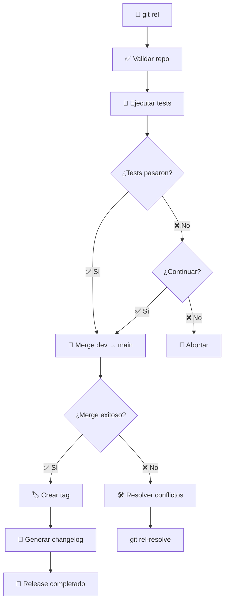

# 🚀 Git Release Script (`git_rel.sh`)

> **Script automatizado para hacer releases de `dev` a `main` con gestión inteligente de conflictos, tests automáticos y generación de changelogs.**

## 📋 Tabla de Contenidos

- [🎯 Descripción](#-descripción)
- [✨ Características](#-características)
- [🔧 Instalación](#-instalación)
- [📖 Uso Básico](#-uso-básico)
- [🎛️ Opciones Avanzadas](#️-opciones-avanzadas)
- [🔍 Detección Automática de Tests](#-detección-automática-de-tests)
- [⚡ Casos de Uso](#-casos-de-uso)
- [🛠️ Resolución de Conflictos](#️-resolución-de-conflictos)
- [📊 Flujo de Trabajo](#-flujo-de-trabajo)
- [🔧 Configuración](#-configuración)
- [❓ FAQ](#-faq)

## 🎯 Descripción

El script `git_rel.sh` automatiza el proceso de release de código desde la rama de desarrollo (`dev`) a la rama principal (`main`). Incluye validaciones, tests automáticos, gestión inteligente de conflictos y generación de changelogs.

## ✨ Características

- 🔄 **Merge inteligente**: Maneja automáticamente casos de no fast-forward
- 🧪 **Tests automáticos**: Detecta y ejecuta tests según el tipo de proyecto
- 🏷️ **Versionado automático**: Genera tags con formato `vYYYY.MM.DD_HHMM`
- 📝 **Changelogs**: Genera automáticamente changelogs del release
- 🔍 **Detección de conflictos**: Identifica conflictos potenciales antes del merge
- 🎨 **Output colorido**: Interfaz visual con colores y emojis
- 🛡️ **Validaciones**: Verifica estado del repositorio y permisos

## 🔧 Instalación

El script ya está configurado en tu `~/.gitconfig` con el alias:

```bash
rel = "!bash ~/dotfiles/scripts/git_rel.sh"
```

## 📖 Uso Básico

### 🎯 Comando Principal

```bash
git rel
```

**Ejemplo de salida:**
```
🚀 Iniciando release de dev a main...
🧪 Ejecutando tests...
✅ Tests de Node.js pasaron
🔁 Haciendo merge de 'dev' → 'main'...
✅ Merge completado exitosamente
🏷️ Creando tag 'v2024.01.15_1430'...
✅ Tag 'v2024.01.15_1430' creado y subido.
📝 Generando changelogs...
✅ Changelogs generados exitosamente
🎉 ¡Release completado exitosamente!
```

### 🏷️ Con Versión Específica

```bash
git rel 1.2.3
```

**Resultado:** Crea el tag `v1.2.3`

## 🎛️ Opciones Avanzadas

### ⚡ Saltar Tests

```bash
git rel --skip-tests
# o
git rel --force
```

**Casos de uso:**
- 🔥 Hotfixes urgentes
- 🧪 Tests que tardan mucho
- 🔧 Configuraciones de desarrollo

### 🆘 Ayuda

```bash
git rel --help
# o
git rel -h
```

**Salida:**
```
📖 Uso: git rel [versión] [opciones]
📖 Ejemplos:
  git rel                    # Release con versión automática
  git rel 1.2.3              # Release con versión específica
  git rel --force            # Release saltando tests
  git rel 1.2.3 --skip-tests # Release con versión y saltando tests
📖 Opciones:
  --force, --skip-tests      # Continuar aunque los tests fallen
  --help, -h                 # Mostrar esta ayuda
```

## 🔍 Detección Automática de Tests

El script detecta automáticamente el tipo de proyecto y ejecuta los tests correspondientes:

| 🏷️ Tipo | 📁 Archivo | 🧪 Comando | 💡 Descripción |
|---------|------------|------------|----------------|
| 📦 Node.js | `package.json` | `npm test` | Tests de JavaScript/TypeScript |
| 🐍 Python | `requirements.txt` | `python3 -m pytest` | Tests con pytest |
| ☕ Maven | `pom.xml` | `mvn test` | Tests de Java |
| ☕ Gradle | `build.gradle` | `./gradlew test` | Tests de Java/Gradle |
| 🦀 Rust | `Cargo.toml` | `cargo test` | Tests de Rust |
| 🐹 Go | `go.mod` | `go test ./...` | Tests de Go |
| 🐘 PHP | `composer.json` | `composer test` | Tests de PHP |
| 💎 Ruby | `Gemfile` | `bundle exec rspec` | Tests de Ruby |
| 🔨 Makefile | `Makefile` | `make test` | Tests personalizados |

### 🔧 Script Personalizado

Si existe `scripts/test.sh`, se ejecuta en lugar de los tests automáticos:

```bash
# Crear scripts/test.sh
#!/bin/bash
echo "🧪 Ejecutando tests personalizados..."
# Tus tests aquí
```

## ⚡ Casos de Uso

### 🚀 Release Normal

```bash
# 1. Asegúrate de estar en dev y tener cambios
git checkout dev
git pull origin dev

# 2. Ejecuta el release
git rel

# 3. ¡Listo! El código está en main con tag
```

### 🔥 Hotfix Urgente

```bash
# Release sin tests para urgencias
git rel --skip-tests

# O con versión específica
git rel 1.2.4 --force
```

### 🏷️ Release con Versión

```bash
# Release con versión semántica
git rel 2.1.0

# Release con versión personalizada
git rel v2024.01.15-beta
```

## 🛠️ Resolución de Conflictos

### 🔍 Detección Inteligente

El script detecta conflictos potenciales antes del merge:

```
🔍 Verificando conflictos potenciales entre 'dev' y 'main'...
✅ No se detectaron conflictos potenciales
```

### ⚠️ Conflictos Reales

Si hay conflictos reales, el script te guía:

```
❗ Conflictos detectados entre 'dev' y 'main'
💡 Sugerencia: Resuelve los conflictos y luego ejecuta:
  git add .
  git commit -m "merge: resolve conflicts between dev and main"
```

### 🛠️ Script de Resolución

Usa el script auxiliar `git_rel_resolve.sh`:

```bash
# Ver estado del merge
git rel-resolve

# Abortar merge
git rel-resolve --abort

# Continuar después de resolver conflictos
git rel-resolve --continue
```

## 📊 Flujo de Trabajo



## 🔧 Configuración

### 📁 Variables del Script

```bash
# En scripts/git_rel.sh
DEV_BRANCH="dev"           # Rama de desarrollo
MAIN_BRANCH="main"         # Rama principal
TAG_PREFIX="v"             # Prefijo de tags
SKIP_TESTS=false           # Saltar tests por defecto
```

### 🎨 Personalización de Colores

```bash
# Colores disponibles
GREEN='\033[0;32m'         # ✅ Éxito
YELLOW='\033[1;33m'        # ⚠️ Advertencia
RED='\033[0;31m'           # ❌ Error
BLUE='\033[0;34m'          # 💡 Información
NC='\033[0m'               # Reset color
```

## ❓ FAQ

### 🤔 ¿Qué pasa si no hay cambios entre dev y main?

El script detecta automáticamente que no hay cambios y continúa sin problemas.

### 🔄 ¿Qué pasa si no se puede hacer fast-forward?

El script intenta automáticamente un merge con `--no-ff` y continúa.

### 🧪 ¿Cómo configurar tests personalizados?

Crea `scripts/test.sh` en tu proyecto y el script lo ejecutará automáticamente.

### 🏷️ ¿Cómo cambiar el formato de versiones?

Modifica la variable `TAG_PREFIX` en el script o usa versiones específicas con `git rel 1.2.3`.

### 🛠️ ¿Qué hacer si hay conflictos reales?

1. Usa `git rel-resolve` para ver el estado
2. Resuelve los conflictos manualmente
3. Usa `git rel-resolve --continue` para completar

### 📝 ¿Dónde se generan los changelogs?

Los changelogs se generan usando `~/dotfiles/scripts/git_changelog.sh` y se guardan en el directorio del proyecto.

---

## 🎉 ¡Listo para usar!

El script `git_rel.sh` está diseñado para hacer releases de forma segura y eficiente. ¡Disfruta de releases automatizados! 🚀 