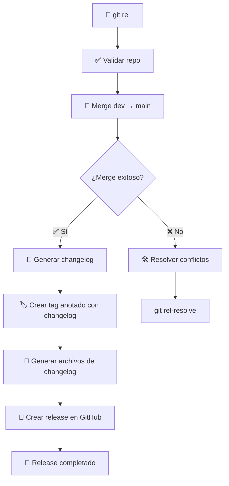

# 🚀 Git Release Script (`git_rel.sh`)

> **Script automatizado para hacer releases de `dev` a `main` con gestión inteligente de conflictos, tags anotados con changelog completo y creación automática de releases en GitHub.**

## 📋 Tabla de Contenidos

- [🎯 Descripción](#-descripción)
- [✨ Características](#-características)
- [🔧 Instalación](#-instalación)
- [📖 Uso Básico](#-uso-básico)
- [🎛️ Opciones Avanzadas](#️-opciones-avanzadas)
- [🔍 Detección Automática de Tests](#-detección-automática-de-tests)
- [⚡ Casos de Uso](#-casos-de-uso)
- [🛠️ Resolución de Conflictos](#️-resolución-de-conflictos)
- [📊 Flujo de Trabajo](#-flujo-de-trabajo)
- [🔧 Configuración](#-configuración)
- [❓ FAQ](#-faq)

## 🎯 Descripción

El script `git_rel.sh` automatiza el proceso de release de código desde la rama de desarrollo (`dev`) a la rama principal (`main`). Incluye validaciones, gestión inteligente de conflictos, generación de changelogs, creación de tags anotados con documentación completa y creación automática de releases en GitHub.

## ✨ Características

- 🔄 **Merge inteligente**: Maneja automáticamente casos de no fast-forward
- 🏷️ **Tags anotados profesionales**: Crea tags anotados con formato `vYYYY.MM.DD_HHMM` que incluyen el changelog completo como mensaje
- 📝 **Changelogs mejorados**: Genera changelogs con fecha, hora y hash del commit en formato markdown
- 🚀 **Releases de GitHub**: Crea automáticamente releases en GitHub usando `gh` CLI con el changelog completo
- 🔍 **Detección de conflictos**: Identifica conflictos potenciales antes del merge
- 🎨 **Output colorido**: Interfaz visual con colores y emojis
- 🛡️ **Validaciones**: Verifica estado del repositorio y permisos
- 📊 **Categorización inteligente**: Organiza commits por tipo (feat, fix, docs, refactor, etc.)

## 🔧 Instalación

El script ya está configurado en tu `~/.gitconfig` con el alias:

```bash
rel = "!bash ~/dotfiles/scripts/git_rel.sh"
```

## 📖 Uso Básico

### 🎯 Comando Principal

```bash
git rel
```

**Ejemplo de salida:**
```
🚀 Iniciando release de dev a main...
🔁 Integrando 'dev' en 'main'...
✅ Merge completado: 'dev' → 'main'
🏷️ Creando tag 'v2025.12.07_1051'...
📝 Generando changelog para el tag...
✅ Changelog generado exitosamente
🏷️ Creando tag anotado 'v2025.12.07_1051' en el commit actual...
✅ Tag anotado 'v2025.12.07_1051' creado y subido exitosamente a GitHub.
📝 Generando archivos de changelog...
✅ Archivos de changelog generados exitosamente
🚀 Creando release en GitHub...
✅ Release 'v2025.12.07_1051' creado exitosamente en GitHub
🎉 ¡Release completado exitosamente!
```

### 🏷️ Con Versión Específica

```bash
git rel 1.2.3
```

**Resultado:** Crea el tag `v1.2.3`

## 🎛️ Opciones Avanzadas

### 🆘 Ayuda

```bash
git rel --help
# o
git rel -h
```

**Salida:**
```
📖 Uso: git rel [versión]
📖 Ejemplos:
  git rel                    # Release con versión automática
  git rel 1.2.3              # Release con versión específica
📖 Opciones:
  --help, -h                 # Mostrar esta ayuda
```

## 📝 Formato de Changelog

El script genera changelogs con un formato profesional que incluye:

- **Fecha y hora**: Formato `YYYY-MM-DD HH:MM`
- **Hash del commit**: Código corto del commit entre backticks de markdown
- **Mensaje del commit**: Tipo, scope y descripción
- **Autor**: Nombre del autor del commit

**Ejemplo de línea de changelog:**
```markdown
- 2025-12-07 10:51 `7aa62e4` feat(git_rel): improve tag generation with annotated tags and GitHub releases (Jesús Erro)
```

### 📊 Categorización Automática

Los commits se organizan automáticamente en categorías:

- **Added**: Commits tipo `feat` o `feature`
- **Fixed**: Commits tipo `fix`
- **Documentation**: Commits tipo `docs`
- **Refactored**: Commits tipo `refactor`
- **Tests**: Commits tipo `test`
- **Style**: Commits tipo `style`
- **Chores**: Commits tipo `chore`
- **Other**: Otros commits que no coinciden con los tipos anteriores

## ⚡ Casos de Uso

### 🚀 Release Normal

```bash
# 1. Asegúrate de estar en dev y tener cambios
git checkout dev
git pull origin dev

# 2. Ejecuta el release
git rel

# 3. ¡Listo! El código está en main con tag
```

### 🔥 Hotfix Urgente

```bash
# Release con versión específica para urgencias
git rel 1.2.4
```

### 🏷️ Release con Versión

```bash
# Release con versión semántica
git rel 2.1.0

# Release con versión personalizada
git rel v2024.01.15-beta
```

## 🛠️ Resolución de Conflictos

### 🔍 Detección Inteligente

El script detecta conflictos potenciales antes del merge:

```
🔍 Verificando conflictos potenciales entre 'dev' y 'main'...
✅ No se detectaron conflictos potenciales
```

### ⚠️ Conflictos Reales

Si hay conflictos reales, el script te guía:

```
❗ Conflictos detectados entre 'dev' y 'main'
💡 Sugerencia: Resuelve los conflictos y luego ejecuta:
  git add .
  git commit -m "merge: resolve conflicts between dev and main"
```

### 🛠️ Script de Resolución

Usa el script auxiliar `git_rel_resolve.sh`:

```bash
# Ver estado del merge
git rel-resolve

# Abortar merge
git rel-resolve --abort

# Continuar después de resolver conflictos
git rel-resolve --continue
```

## 📊 Flujo de Trabajo



## 🔧 Configuración

### 📁 Variables del Script

```bash
# En scripts/git_rel.sh
DEV_BRANCH="dev"           # Rama de desarrollo
MAIN_BRANCH="main"         # Rama principal
TAG_PREFIX="v"             # Prefijo de tags (formato: vYYYY.MM.DD_HHMM)
```

### 🎨 Personalización de Colores

```bash
# Colores disponibles
GREEN='\033[0;32m'         # ✅ Éxito
YELLOW='\033[1;33m'        # ⚠️ Advertencia
RED='\033[0;31m'           # ❌ Error
BLUE='\033[0;34m'          # 💡 Información
NC='\033[0m'               # Reset color
```

## ❓ FAQ

### 🤔 ¿Qué pasa si no hay cambios entre dev y main?

El script detecta automáticamente que no hay cambios y continúa sin problemas.

### 🔄 ¿Qué pasa si no se puede hacer fast-forward?

El script intenta automáticamente un merge con `--no-ff` y continúa.

### 🏷️ ¿Cómo funcionan los tags anotados?

Los tags creados son **anotados** e incluyen el changelog completo como mensaje. Esto significa que cuando veas el tag en GitHub o con `git show`, verás toda la información del release.

### 🚀 ¿Cómo se crean los releases en GitHub?

El script intenta crear automáticamente un release en GitHub usando `gh` CLI. Si `gh` CLI no está instalado o no está autenticado, el script mostrará el contenido del changelog para que puedas crearlo manualmente.

**Para habilitar releases automáticos:**
```bash
# Instalar gh CLI
# En Ubuntu/Debian:
sudo apt install gh

# Autenticarse con permisos de repo
gh auth login --scopes repo
```

### 🏷️ ¿Cómo cambiar el formato de versiones?

Modifica la variable `TAG_PREFIX` en el script o usa versiones específicas con `git rel 1.2.3`.

### 🛠️ ¿Qué hacer si hay conflictos reales?

1. Usa `git rel-resolve` para ver el estado
2. Resuelve los conflictos manualmente
3. Usa `git rel-resolve --continue` para completar

### 📝 ¿Dónde se generan los changelogs?

Los changelogs se generan automáticamente y se guardan en:
- `releases/TAG.md`: Changelog individual por release
- `CHANGELOG.md`: Changelog principal con las últimas 5 releases

**Formato del changelog:**
- Cada línea incluye: fecha, hora, hash del commit (en backticks), mensaje y autor
- Los commits se categorizan automáticamente (Added, Fixed, Documentation, etc.)
- Solo se consideran tags de release (con el prefijo configurado) para calcular diferencias

### 🔍 ¿Cómo detecta el tag anterior?

El script busca automáticamente el último tag de release (que empieza con el prefijo configurado, normalmente "v") antes del tag actual. Si no encuentra un tag anterior, muestra todos los commits desde el inicio del repositorio.

---

## 🎉 ¡Listo para usar!

El script `git_rel.sh` está diseñado para hacer releases de forma segura y eficiente. ¡Disfruta de releases automatizados! 🚀 