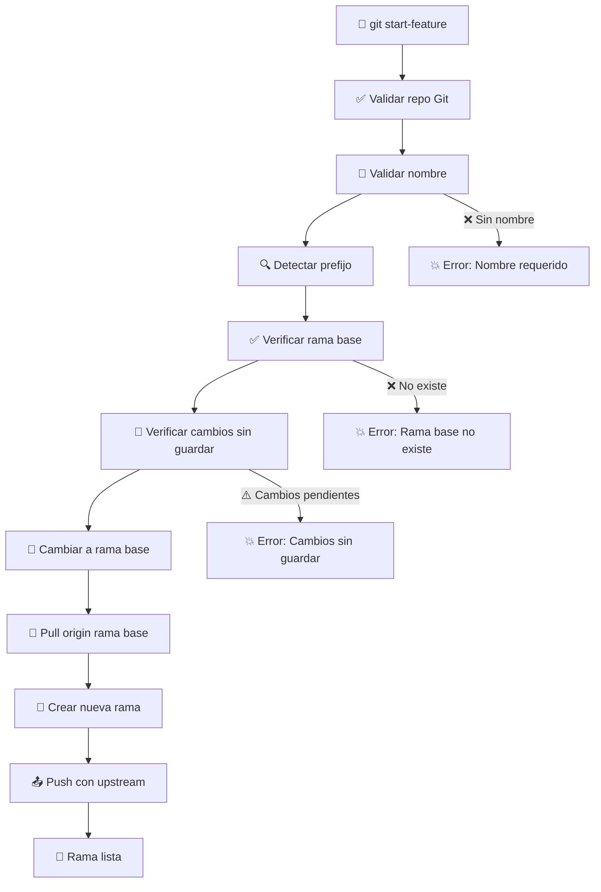

# 🌱 Git Start Feature Script (`git_start_feature.sh`)

> **Script automatizado para crear y publicar nuevas ramas de features desde la rama base, con validaciones y configuración automática.**

## 📋 Tabla de Contenidos

- [🎯 Descripción](#-descripción)
- [✨ Características](#-características)
- [🔧 Instalación](#-instalación)
- [📖 Uso Básico](#-uso-básico)
- [🎛️ Opciones](#️-opciones)
- [🔄 Flujo de Trabajo](#-flujo-de-trabajo)
- [📊 Ejemplos de Salida](#-ejemplos-de-salida)
- [⚡ Casos de Uso](#-casos-de-uso)
- [🔧 Configuración](#-configuración)
- [❓ FAQ](#-faq)

## 🎯 Descripción

El script `git_start_feature.sh` automatiza el proceso de creación de nuevas ramas de features. Actualiza la rama base, crea la nueva rama con el prefijo correcto y la publica automáticamente en el repositorio remoto.

## ✨ Características

- 🌱 **Creación automática**: Crea ramas de features con prefijo `feature/`
- 🔄 **Actualización automática**: Actualiza la rama base antes de crear la nueva
- 📤 **Publicación automática**: Publica la rama en el remoto con upstream configurado
- 🛡️ **Validaciones**: Verifica estado del repositorio y cambios sin guardar
- 🎨 **Output colorido**: Interfaz visual con colores y emojis
- 🔍 **Detección inteligente**: Maneja automáticamente prefijos de rama
- 🚀 **Configuración rápida**: Listo para desarrollar inmediatamente

## 🔧 Instalación

El script ya está configurado en tu `~/.gitconfig` con el alias:

```bash
start-feature = "!bash ~/dotfiles/scripts/git_start_feature.sh"
```

## 📖 Uso Básico

### 🎯 Comando Principal

```bash
git start-feature <nombre-feature>
```

### 📝 Ejemplos de Uso

```bash
git start-feature auth-login           # Crea feature/auth-login
git start-feature feature/user-profile # Crea feature/user-profile
git start-feature bugfix-123           # Crea feature/bugfix-123
```

### 📊 Ejemplo de Salida

```
🔄 Cambiando a la rama base 'dev' y actualizándola...
🌱 Creando nueva rama: 'feature/auth-login' desde 'dev'...
✅ Rama 'feature/auth-login' creada y publicada en remoto.
🚀 ¡Listo para desarrollar!
```

## 🎛️ Opciones

### 🆘 Ayuda

El script no tiene opciones adicionales, pero muestra ayuda en caso de error:

```bash
git start-feature
# Error: Debes proporcionar un nombre para la nueva rama feature.
# Uso: ./git_start_feature.sh auth-login
```

## 🔄 Flujo de Trabajo



## 📊 Ejemplos de Salida

### ✅ Creación Exitosa

```bash
git start-feature login-system
```

**Salida:**
```
🔄 Cambiando a la rama base 'dev' y actualizándola...
🌱 Creando nueva rama: 'feature/login-system' desde 'dev'...
✅ Rama 'feature/login-system' creada y publicada en remoto.
🚀 ¡Listo para desarrollar!
```

### ⚠️ Con Prefijo Explícito

```bash
git start-feature feature/user-profile
```

**Salida:**
```
🔄 Cambiando a la rama base 'dev' y actualizándola...
🌱 Creando nueva rama: 'feature/user-profile' desde 'dev'...
✅ Rama 'feature/user-profile' creada y publicada en remoto.
🚀 ¡Listo para desarrollar!
```

### ❌ Error: Sin Nombre

```bash
git start-feature
```

**Salida:**
```
❗ Debes proporcionar un nombre para la nueva rama feature.
👉 Uso: ./git_start_feature.sh auth-login
```

### ❌ Error: Cambios Sin Guardar

```bash
git start-feature new-feature
```

**Salida:**
```
❗ Tienes cambios sin guardar. Haz commit o stash antes de continuar.
On branch feature/current
Changes not staged for commit:
  (use "git add <file>..." to update what will be committed)
  (use "git restore <file>..." to discard changes in working directory)
        modified:   src/components/Login.js
```

## ⚡ Casos de Uso

### 🚀 Inicio de Nuevo Proyecto

```bash
# Crear primera feature
git start-feature initial-setup

# Crear feature de autenticación
git start-feature auth-system

# Crear feature de UI
git start-feature user-interface
```

### 🔧 Desarrollo de Features

```bash
# Feature de login
git start-feature login-form
git start-feature oauth-integration
git start-feature password-reset

# Feature de usuarios
git start-feature user-profile
git start-feature user-settings
git start-feature user-permissions
```

### 🐛 Corrección de Bugs

```bash
# Bugfixes
git start-feature bugfix-login-error
git start-feature bugfix-api-timeout
git start-feature bugfix-ui-responsive
```

### 📚 Documentación

```bash
# Features de documentación
git start-feature docs-api
git start-feature docs-installation
git start-feature docs-examples
```

## ❓ FAQ

### 🤔 ¿Desde qué rama debo crear una nueva feature?

**Respuesta:** Siempre desde `dev`. El script automáticamente:
1. Cambia a la rama `dev`
2. Actualiza `dev` con `git pull origin dev`
3. Crea la nueva feature desde `dev`

**Razón:** `dev` es la rama de integración continua donde confluyen todas las features. Nunca trabajes directamente en `main`.

### 🏷️ ¿Cómo usar correctamente el comando?

**Respuesta:** El script añade automáticamente el prefijo `feature/`. Ejemplos:

```bash
# ✅ Correcto - genera: feature/adding-dbt
git start-feature adding-dbt

# ❌ Incorrecto - genera: feature/feature/adding-dbt
git start-feature feature/adding-dbt
```

**Regla:** No incluyas el prefijo `feature/` en el nombre, el script lo añade automáticamente.

### 🔄 ¿Qué pasa si ya existe una rama con ese nombre?

El script verificará si la rama existe y te mostrará un error si ya existe. Debes usar un nombre único para cada feature.

### 🚨 ¿Qué pasa si tengo cambios sin guardar?

El script verificará que no tengas cambios sin guardar antes de cambiar de rama. Debes hacer `git add` y `git commit` o `git stash` antes de crear una nueva feature.

### 🧪 Testing

```bash
# Features de testing
git start-feature test-coverage
git start-feature test-integration
git start-feature test-e2e
```

## 🔧 Configuración

### 📁 Variables del Script

```bash
# En scripts/git_start_feature.sh
BASE_BRANCH="dev"                    # Rama base para crear features
FEATURE_PREFIX="feature/"            # Prefijo para ramas de features
```

### 🎨 Personalización

```bash
# Cambiar rama base
BASE_BRANCH="develop"

# Cambiar prefijo de features
FEATURE_PREFIX="feat/"

# Añadir más prefijos
if [[ "$RAW_NAME" == feature/* ]] || [[ "$RAW_NAME" == feat/* ]]; then
  FEATURE_BRANCH="$RAW_NAME"
else
  FEATURE_BRANCH="${FEATURE_PREFIX}${RAW_NAME}"
fi
```

### 🎨 Colores Disponibles

```bash
# Colores del script
GREEN='\033[0;32m'         # ✅ Éxito
YELLOW='\033[1;33m'        # ⚠️ Advertencia
RED='\033[0;31m'           # ❌ Error
NC='\033[0m'               # Reset color
```

## ❓ FAQ

### 🤔 ¿Qué rama base usa por defecto?

El script usa `dev` como rama base por defecto. Se puede configurar cambiando la variable `BASE_BRANCH`.

### 📝 ¿Cómo maneja los prefijos de rama?

- **Sin prefijo**: `git start-feature login` → `feature/login`
- **Con prefijo**: `git start-feature feature/login` → `feature/login`

### 🔄 ¿Qué pasa si la rama base no existe?

El script verifica que la rama base exista localmente:

```
❗ La rama base 'dev' no existe localmente.
```

### 🧼 ¿Qué pasa si hay cambios sin guardar?

El script requiere que el working directory esté limpio:

```
❗ Tienes cambios sin guardar. Haz commit o stash antes de continuar.
```

### 📤 ¿La rama se publica automáticamente?

Sí, el script hace `git push --set-upstream origin <rama>` para publicar la rama y configurar el upstream.

### 🔄 ¿Se actualiza la rama base?

Sí, el script hace `git pull origin <rama-base>` para asegurar que la rama base esté actualizada.

### 🏷️ ¿Puedo usar nombres con espacios?

No, usa guiones o guiones bajos:

```bash
git start-feature user-profile    # ✅ Correcto
git start-feature user_profile    # ✅ Correcto
git start-feature "user profile"  # ❌ No funciona
```

### 🔍 ¿Cómo ver las ramas creadas?

```bash
# Ver ramas locales
git branch

# Ver ramas remotas
git branch -r

# Ver todas las ramas
git branch -a
```

### 🗑️ ¿Cómo eliminar una rama de feature?

```bash
# Eliminar rama local
git branch -d feature/nombre

# Eliminar rama remota
git push origin --delete feature/nombre
```

### 🔄 ¿Puedo cambiar la rama base después de crear la feature?

Sí, puedes hacer rebase:

```bash
git rebase --onto nueva-base rama-actual feature/nombre
```

### 📊 ¿Cómo ver el estado de todas las features?

```bash
# Ver ramas de features
git branch | grep feature/

# Ver ramas con información adicional
git for-each-ref --format='%(refname:short) %(committerdate:relative)' refs/heads/feature/
```

---

## 🎉 ¡Listo para usar!

El script `git_start_feature.sh` simplifica la creación de ramas de features. ¡Perfecto para mantener un flujo de trabajo organizado y eficiente! 🌱 